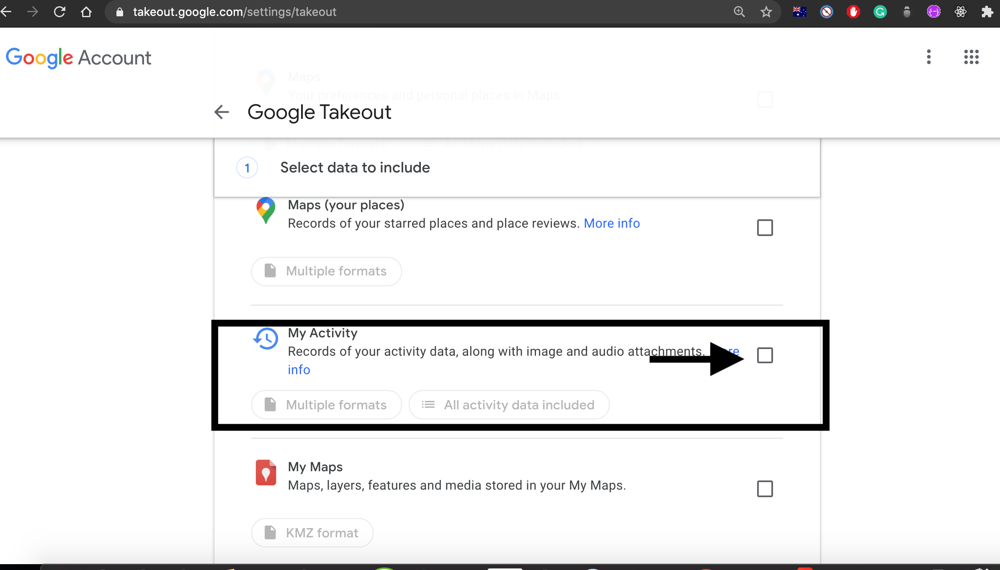
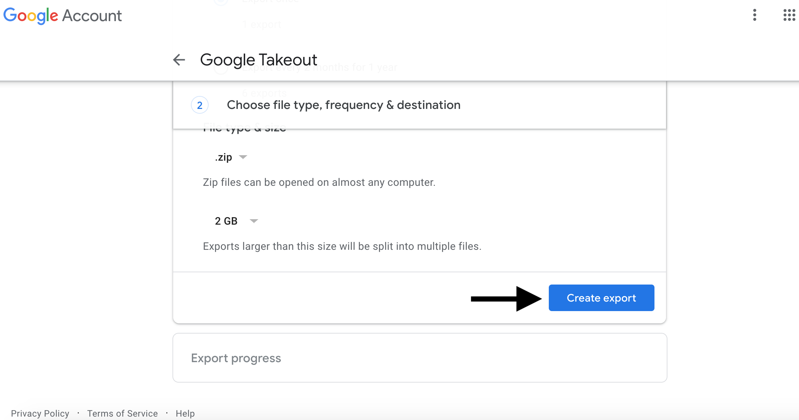
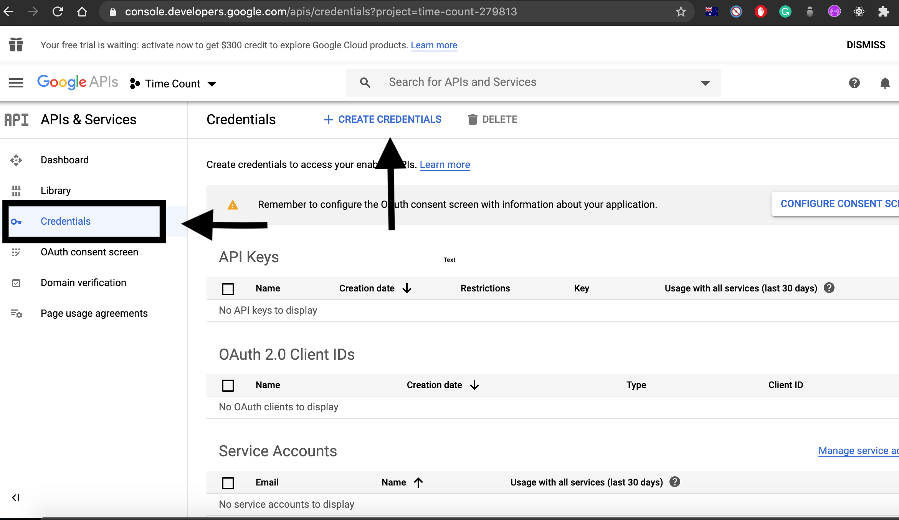
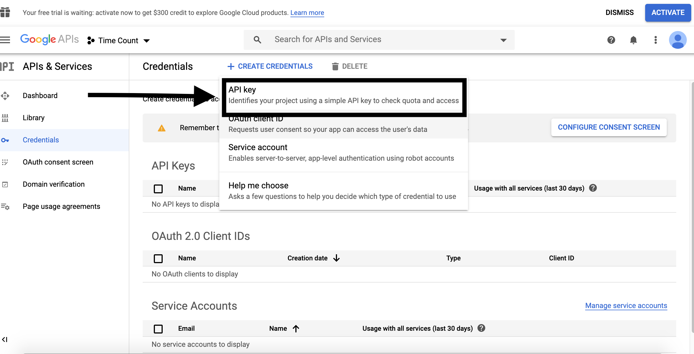
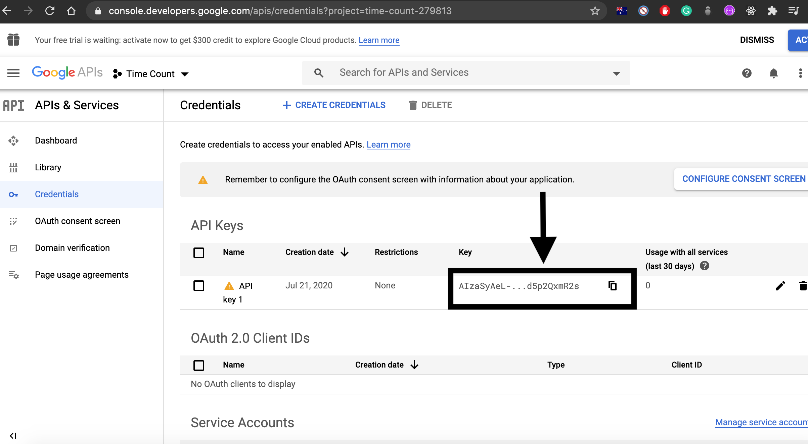

# History Analytics :
This repository included various small projects. Description about each project is given below.

## 1. Number of Google Searches:

-Wrote a little script ( NumberOfGoogleSearches.py ) to find out total number of google searches i have done in my lifetime.

-Google Takeout data is required.

-It is done using Beautiful Soup package which is used to parse HTML files.

In case you want to use this script, follow the step given below.

### Process to get Google Takeout data:

a. Google Search "Google takeout", click on the first link and navigate to the location shown in the image below, by logging in to your Google account.

b. Check the box shown in the above image and continue to next step.

c. Click Create Export as shown in the image above. Once the export is created Google will send you an email and you can download the .zip file. On unzipping the file you will find a folder called Takeout. 

d. Navigate to Takeout/My Activity/Search, you will find a MyActivity.html, this MyActivity.html file is used in NumberOfGoogleSearches.py program. Give appropriate path for that file in the program or copy it in the same directory as program.

## 2. YouTube Watch Time (Total duration of all the videos watched on YouTube):

-I always wanted to find out total duration of all the videos that i have watched on YouTube in my lifetime. So, using Google Takeout(Steps to get this is shown in the description of first project) got my watch history of YouTube. 

-I thought of two approaches to do it.

- Main script is Time.py in both the approaches. And the MyActivity.html file used in it can be found using the steps given in the description of first project, only difference is that MyActivity.html used in this project can be found at this path Takeout/My Activity/YouTube .

### (A) First Approach : Using YouTube API:

-Once i parse the MyActivity.html i got from google takeout (Takeout/My Activity/YouTube), i get a YouTube url, so somehow i had to get duration of that video from the YouTube url. So, i used YouTube API to get the duration of that video and then add them. But later on found out that YouTube API has a daily quota limit of 10000 unit and a read operation to get the duration of a YouTube video costs 3 unit. So, quick math, i realised that i can only find out duration of 3333 videos in a day. So, requested Google to increase my daily quota limit and haven't heard back from them. So, decided to change my approach and use web scraping but it had its own set of hurdles.

#### Steps to get your own YouTube API key are given below:

https://developers.google.com/youtube/v3/getting-started Go through the first few steps given in this link.

Once you sign up and are logged in follow the images below to get API key:

Once you generate the API key copy paste that API key in YouTubeAPI.py in place of DEVELOPER_KEY present there.

### (B) Second Approach : Using Web Scraping:

As i said this approach had it's own set of hurdles. As the duration tag generated on YouTube website is dynamically generated by JavaScript, so had to use a web browsers automation tool called Selenium so that once the duration tag is generated then only i get html file of that page to parse for duration of that video. But i quickly realised that some YouTube have ads before them so i was grabbing the duration of that ad video instead of the actual youtube video. So, had to load and use a YouTube adblocker extension for the chromedriver used by Selenium. But the adblocker extension did not skip the ad altogether, it added a button to skip ad, so had to click that button using Selenium and then finally i could skip the ad and get the actual duration of that YouTube video. So, finally was able to get the duration of each YouTube video and add them.

ADYoutube.crx file is the extension used to skip ad on YuuTube.

chromedriver is the webdriver used by Selenium.

But this approach takes time while the first approach is quite fast and practical but only problem with that approach is that YouTube API has a daily quota limit, even on simple read operations. And the process to increase the daily quota is tedious to say the least.
